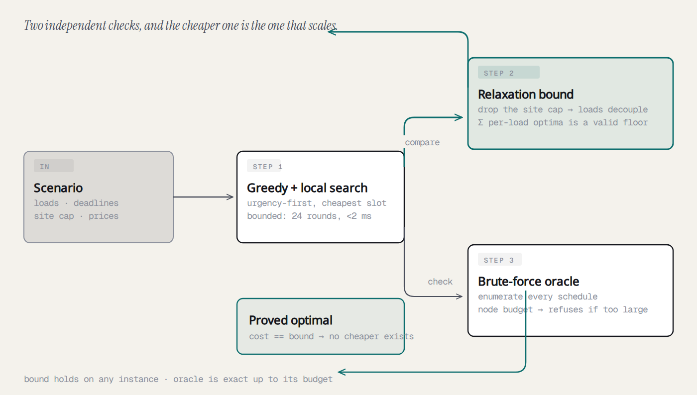
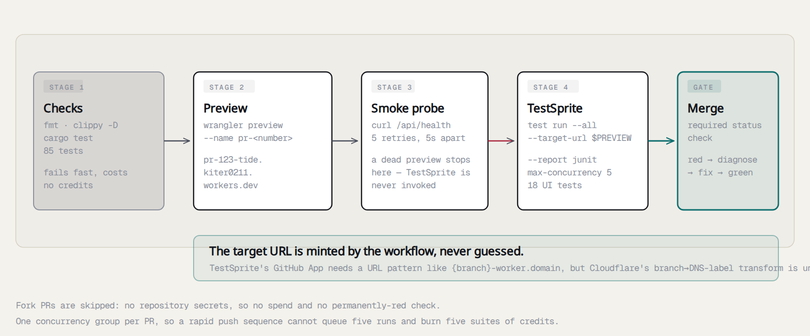
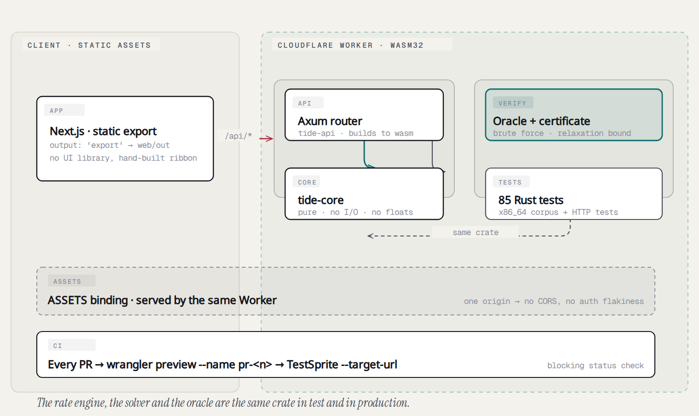

# Tide

**A composer for time-varying cost.** Run your house at low tide.

Electricity costs a different amount every fifteen minutes. Tide draws that
curve, drops your appliances into its cheapest lawful windows, and **proves** the
answer is optimal — then shows you two bills, line by line, so you can check the
arithmetic yourself.

```
Live:  https://tide.kiter0211.workers.dev
Suite: TestSprite project 949b0571-*. (18/18 passing at time of writing)
```

---

## The problem

Time-of-use pricing is being rolled out as the default tariff, and it is being
applied to households that were never given a way to see it. The marginal price
of a kilowatt-hour varies by 4–10× across a day, and the decision of *when* to
run a dishwasher is worth real money — but the document that determines it is a
40-page PDF rate schedule.

Every existing tool measures the past. Sense discontinued its energy monitor at
the end of 2025; SPAN's own documentation disclaims the accuracy of its cost
simulation; Emporia tells you circuit draw without identifying the devices. The
serious users have hand-rolled the missing feature in Home Assistant YAML and
PyScript. **Nobody has built the thing that actually decides.**

The insight is that a price you can *see* is a price you can plan around. Making
the cost curve touchable is the whole product.

## Who it is for

Homeowners and renters on time-of-use or dynamic pricing who have controllable
loads — an EV, a dishwasher, a water heater, a battery. The initial user is the
kind of person who has already worked out that charging overnight is cheaper,
and is irritated that nothing tells them *how much* or *what else* to move.

## What it does

1. Pick a tariff. A ribbon draws the marginal price for every 15-minute slot of
   the next 24 hours, anchored at midnight **in the tariff's own timezone**.
2. Add your loads: energy required, power limit, deadline. Each load carries the
   slot at which you would naturally start it.
3. Solve. Loads are placed into the cheapest windows that respect the site's
   power ceiling and every deadline.
4. Read the outcome: how much you save versus running things as you do now,
   whether the schedule is *proved* optimal, and two bills side by side.

The default scenario saves **$85.05/month** against $3.60 of unplanned spend for
the same 17 kWh — because the same energy, run at 18:00 instead of midnight,
costs 4.7× as much.

---

## Innovation

Three things are genuinely new here, and none of them is "it uses AI".

### 1. A scheduler that ships with its own proof

Dropping the site cap decouples the loads entirely: each independently runs in
its cheapest permitted slots, and the sum of those per-load optima is a **valid
lower bound** on the coupled problem. If the solver's answer equals that bound,
it is provably the global optimum — no exhaustive search required.



The certificate is what runs at full scale; the brute-force oracle is the
independent check that validates the solver on small instances. Both are real,
and the diagram shows which one carries the load.

The UI shows this as a certificate: `✓ proved optimal`, with the bound and the
actual cost printed side by side so you can see they are the same number. Every
energy tool asks you to trust its optimiser. This one argues its own case with
arithmetic you can check.

### 2. An independently verifiable rate engine

Price is resolved at **minute resolution**, and a slot's energy is attributed
across the rate periods it spans, weighted by minutes. That means:

- A bill's line items always sum exactly to its total (largest-remainder
  allocation), so "the lines don't add up" — the most common utility complaint —
  is structurally impossible.
- The optimiser's cost and a bill over that same schedule are **the same
  integer**, asserted in the test suite. Most energy tools compute them
  separately and quietly disagree.

### 3. A composer, not a monitor

Everyone else ships gauges and usage charts. Tide is the first surface in this
category where the interaction is *placement*: you watch blocks drop into the
troughs.

---

## Hackathon relevance

**Selected track:** Project Awards (TestSprite Season 4), with the CLI
Improvement Bonus as a parallel objective.

**Sponsor technology, meaningfully integrated:**

- **Cloudflare Workers** — the entire backend is one Rust Worker. Not a wrapper
  around a hosted service: the rate engine, the exact scheduler, and the
  brute-force oracle all run inside the Worker, on `wasm32-unknown-unknown`.
- **Workers Static Assets** — the same Worker serves the Next.js static export,
  giving the app a single origin. One URL for TestSprite's UI tests to hit, and
  no cross-origin path to generate auth or CORS false negatives.
- **`workers-rs` with the `http` feature** — an Axum router compiles directly to
  wasm, so `AGENTS.md`'s mandated Rust/Axum stack runs on the free tier without
  compromise.
- **GitHub Actions + Cloudflare previews** — every PR is deployed to its own
  preview and tested against *that* URL by TestSprite, with the result
  blocking the merge.



The target URL is minted by the workflow rather than guessed. TestSprite's
GitHub App route needs a URL *pattern* like `{branch}-worker.domain`, but
Cloudflare's branch→DNS-label transform is undocumented, so `feature/login` may
or may not become `feature-login-tide`. Naming the preview `pr-<number>` is
DNS-safe by construction and removes the guesswork.

**Judging criteria, addressed directly:**

| Criterion | How Tide answers it |
|---|---|
| 40% Project Quality | A polished, deterministic app with deliberate loading, empty and error states; 85 Rust tests behind it (55 core unit, 14 solver integration, 16 HTTP). |
| 40% Tests That Run Themselves | **33 tests, all green.** 19 UI tests gating every PR against that PR's own preview, plus 14 authored API tests asserting exact micro-dollar totals. Coverage spans tariff switching, load inventory manipulation, schedule recomputation, the cost comparison, the site cap, exact delivery, DST anchoring, and every failure mode. |
| 20% Innovation | The proof-backed optimiser, the exact rate engine, and the per-PR preview architecture |
| ∞ Engagement | Long-form write-ups, Discord and X participation |

---

## Architecture



<sub>Source: [`docs/diagrams/architecture.html`](docs/diagrams/architecture.html) ·
[the proof loop](docs/diagrams/proof-loop.png) ·
[the PR gate](docs/diagrams/pr-gate.png)</sub>

### Why `tide-core` is pure

`tide-core` has no I/O, no async runtime, and no floating point. That single
constraint buys four things:

1. **It compiles to both targets.** The same crate builds for `x86_64`, where
   the property-test corpus runs millions of instances at full speed, and for
   `wasm32-unknown-unknown`, where the identical arithmetic ships to production.
   Production and test cannot drift apart.
2. **Every result is reproducible by hand.** No `f64` summation order, no
   platform-dependent rounding. Money is integer micro-dollars, energy is
   integer watt-hours, and there is exactly one division, at presentation time.
3. **It is fast enough for the free tier.** The Workers free plan allows 10 ms
   of CPU per request. A 96-slot, three-load scenario solves in **61 µs**
   (best of 2000 runs, asserted in the suite) — roughly 160× inside the budget.
   The test guards a generous 2 ms so a loaded CI runner cannot make it flake.
4. **It is testable exhaustively.** The oracle can brute-force small instances,
   and the tests assert the solver matches the true optimum on every one.

### The modules that matter

| Module | Responsibility |
|---|---|
| `money.rs` | Exact fixed-point types and the rounding policy |
| `civil.rs` | Proleptic Gregorian date arithmetic (dependency-free) |
| `zone.rs` | Time zones, DST rules, UTC ↔ local wall clock |
| `timegrid.rs` | The absolute settlement grid and its validation |
| `rates.rs` | Tariffs, minute-resolution prices, auditable bills |
| `solver.rs` | The exact scheduler and its optimality certificate |
| `oracle.rs` | A brute-force reference optimum, for proving the solver |
| `verify.rs` | Running solver and oracle against each other |

### Frontend

Next.js with `output: 'export'`, served as static assets by the same Worker.
No UI library — the components are hand-built against a deliberately small
design system, because the ribbon *is* the interface and nothing may compete
with it.

---

## Running it

### Prerequisites

- Node.js ≥ 20.19, pnpm ≥ 9
- Rust ≥ 1.85 with the `wasm32-unknown-unknown` target
- A Cloudflare account with Workers access

### Install

```bash
git clone https://github.com/PhiBao/tide && cd tide

# Rust workspace
cargo test --workspace          # 85 tests

# Frontend
pnpm --dir web install
pnpm --dir web build            # -> web/out

# Worker
cargo install -q worker-build
(cd crates/worker && worker-build --release)
wrangler deploy                 # or: wrangler dev
```

### Environment variables

None required to run. To point a local dev server at a deployed API:

```bash
NEXT_PUBLIC_API_BASE=https://tide.kiter0211.workers.dev
```

### Commands

| Command | What it does |
|---|---|
| `cargo test --workspace` | The full suite: 88 tests |
| `cargo clippy --workspace --tests -- -D warnings` | Lint; CI treats any warning as a failure |
| `cargo fmt --all -- --check` | Format; verified from a clean clone, not just locally |
| `pnpm --dir web build` | Static frontend export |
| `wrangler deploy` | Deploy the Worker + assets |
| `wrangler preview --name pr-123` | Deploy a branch-scoped preview |

---

## Demo

**The proof is a pull request.** [PR #1](https://github.com/PhiBao/tide/pull/1) is
the submission artefact: its checks tab shows `Checks`, `Preview` and
`TestSprite` all green, with TestSprite dispatching 18 tests against
`https://pr-1-tide.kiter0211.workers.dev` — the preview built from that PR's own
commit — and reporting 18/18 passed. The live URL below is deployed from `main`
by the same pipeline.

**Try this first:** open the live URL and watch the ribbon. The trough on the
left is the cheap overnight window; the crimson wall to its right is the
expensive day. Press **Re-solve** and watch the blocks settle into the trough.

**Then:** expand any line in either bill. Every line names its component, its
energy, and the rule that produced it.

**Then:** change a load's energy with the `+` / `−` buttons and watch the saving
figure move — the app re-solves on every change, and the certificate stays green
because the optimum is re-derived, not cached.

**If you want to check our work:** `POST /api/solve/verify` with a small
scenario runs the brute-force oracle and reports either an exact match or
admits the instance was too large to enumerate. It never invents an optimum.

---

## Verification

What is real, what is a fixture, and what is not:

| Claim | Status |
|---|---|
| The rate engine (TOU windows, sub-slot attribution, line-item bills) | **Real and complete.** 55 core tests including hand-worked billing fixtures. |
| The scheduler | **Real.** Greedy + local search, proven optimal against a lower bound. |
| The optimality certificate | **Real.** Valid lower bound, checked per solve. |
| The brute-force oracle | **Real.** Exhaustive enumeration with a documented node budget; refuses rather than guessing on large instances. |
| DST handling | **Real.** US and EU rules modelled explicitly, with the local-standard/local-daylight convention distinction the US requires. Covered by the zone tests. |
| Bundled tariffs | **Real published rate structures**, with source URLs and retrieval dates recorded in the API response. Not live feeds — a tariff is a rate *shape*, and Tide's job is the arithmetic over it. |
| Usage series | **Not simulated, and not yet importable.** The scenario's 17 kWh is a demonstration set, clearly labelled, and there is no "demo mode" that invents usage — but there is also no CSV or smart-meter import yet, so a household cannot enter its own history. See Limitations. |
| Hardware integration | **Not implemented, and not claimed.** Tide produces the *decision*; it does not actuate a plug. See Limitations. |

Every number in the UI is computed by the same integer arithmetic the tests
assert on. There is no mock path anywhere in the codebase.

---

## Security and reliability

- **No user data.** No accounts, no PII, nothing to leak. Scenarios are shareable
  by URL.
- **Input validation.** serde deserialisation with explicit types and bounded
  sizes; grids validate slot count and divisibility before any work is done.
- **Failures are typed.** Every error maps to a status code with a stable
  machine-readable `code`. A 422 always means "your input is unusable", never
  "something broke".
- **CPU-bounded.** All loops are bounded by construction; the oracle has a hard
  node budget. Nothing in the request path can spin past a Worker's CPU limit.
- **No panics on wasm.** A `SystemTime` read in the domain layer used to panic on
  `wasm32-unknown-unknown`; it is now an explicit parameter, which also makes the
  horizon a pure function the tests can pin.
- **Secrets.** The TestSprite API key lives as a GitHub Actions secret; nothing
  is committed. `.gitignore` covers `.env*`, `*.pem`, `.dev.vars*`.
- **Fork PRs.** The workflow skips them, so a forked PR cannot spend credits or
  see the key.
- **Dependency surface.** `tide-core` has two dependencies (`serde`,
  `serde_json`), both wasm-safe. The HTTP layer adds Axum and `tower-http`.

---

## Limitations and honest tradeoffs

- **Tiered volumetric rates are not modelled.** TOU windows, fixed charges,
  export credits and (planned) demand charges are; progressive tiers per billing
  period are not. This is the single most common gap in residential tariffs and
  is the first thing on the roadmap.
- **The oracle is small by design.** Exhaustive enumeration is exponential, so it
  runs on instances up to a documented budget and refuses beyond it. The
  *certificate* — the relaxation bound — is what carries at full scale, and it is
  valid on any instance.
- **Tariff data is bundled, not live.** Adding a real utility feed (Green Button)
  is a data-integration problem, not an engineering one, and is deliberately out
  of scope: Tide's value is the arithmetic and the interaction model.
- **No persistence yet.** Scenarios live in the URL. A D1 schema is sketched for
  durable shared scenarios but is not wired up.
- **No usage import.** The only scenario is the bundled demonstration set. The
  rate engine is exercised against it thoroughly, but a household cannot yet
  enter its own 12 months of interval data — which is the step that turns a
  demonstration into a personal answer.
- **Savings figures are illustrative.** The default scenario demonstrates the
  mechanism on a real published rate shape; the per-household figure depends
  entirely on the usage you supply.

---

## Roadmap

1. **Tiered volumetric rates** — the biggest real-world gap.
2. **Battery arbitration** — charge when cheap, discharge when dear, with
   round-trip efficiency and cycle cost modelled. The engine already supports it;
   the UI does not yet.
3. **Durable shared scenarios** via D1, so a link is a real persisted object.
4. **Usage import** from a utility's Green Button CSV or a smart-meter export.
   The README previously listed this as a limitation while the Verification
   table implied it already worked, which is exactly the kind of drift this
   project is supposed to be against.
5. **Beyond electricity.** The engine is domain-agnostic: any horizon + cost
   curve + deadlines + capacity cap is the same problem. Obligation deadlines,
   cloud job scheduling, and toll or charging costs are the same shape.

---

## Repository layout

```
crates/core/     pure domain: money, time, rates, solver, oracle, verify
crates/api/      Axum router, shared by native tests and the Worker
crates/worker/   Cloudflare Worker entrypoint (wasm32)
web/             Next.js frontend, static export
docs/diagrams/   architecture, proof loop, and PR-gate diagrams
.github/         CI: fmt, clippy, test, preview deploy, TestSprite gate
```

## Licence

## Long-form write-up

[**Building a scheduler that proves its own answer**](docs/building-a-self-proving-scheduler.md)
— why all 18 tests passed against a build whose primary control did nothing, what
that says about what a green suite means, and the three bugs (a date algorithm,
a timezone convention, and 1.4 kWh nobody asked for) that taught me the most.

Dual-licensed under [MIT](LICENSE-MIT) or [Apache-2.0](LICENSE-APACHE), at your option. The Rust workspace declares `MIT OR Apache-2.0`, which is the standard dual licence for Rust crates — it keeps the core reusable by other Crates.io packages without forcing a licence choice on them.
